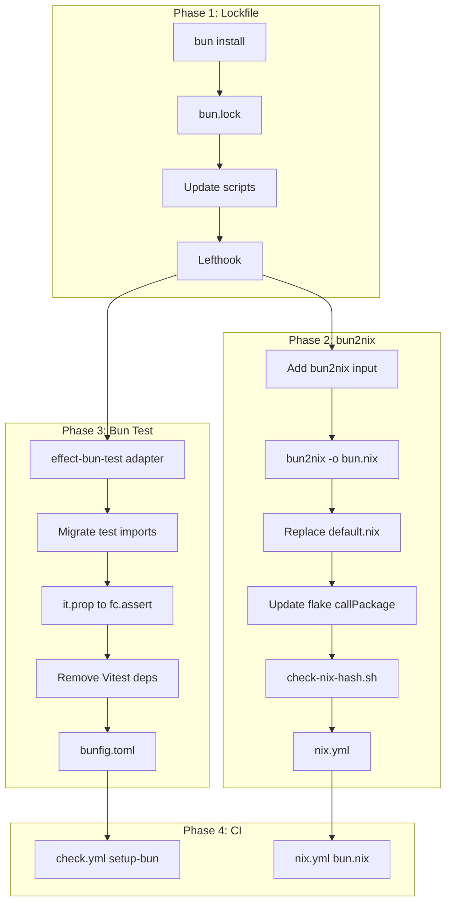

# Bun Migration Plan

**Status:** Phase 1–5 complete  
**Date:** 2026-03-17

**Note:** Phase 3 (Bun test runner) completed — Vitest removed; using `bun test` with local `runEffect` helper (no custom Effect adapter).

**Post-migration:** Build script (scripts/build.ts) derives entrypoints from `package.json` bin (pkgroll convention); source files renamed to `auto-pr-*` for consistency.

---

## Context and Problem Statement

auto-pr historically used npm for package management, Vitest for testing, and `buildNpmPackage` + `prefetch-npm-deps` for Nix builds. Migrating to Bun offers faster installs, native TypeScript execution for dev scripts, and a simpler toolchain—while keeping consumers on Node and the published package unchanged (`dist/*.js`).

**Scope:** Package manager (Bun), Nix builds (bun2nix), test runner (Bun test + local Effect adapter). Consumers remain on Node; no requirement for Bun from users.

---

## Research Summary

### Benefits of Bun

| Benefit | Relevance |
|---------|------------|
| Faster installs | 10–25× faster; useful in CI and for contributors |
| Native TypeScript | No `tsx` for dev scripts; `bun run src/...` runs `.ts` directly |
| Faster tests | Bun's test runner ~0.08s vs Vitest ~0.9s (migrated) |
| Single runtime | One tool for install, build, run, test |
| Node compatibility | Effect and npm packages work; consumers unchanged |

### Why Build Step Still Required

Consumers run `npx auto-pr-*` which executes `dist/*.js` with Node. Node does not run TypeScript. The package ships compiled output; the build step is required for publishing. Bun only removes the need for a build during local development when running source directly.

### Effect + Bun Test Integration

Effect has no `@effect/bun-test`. The `@effect/vitest` package is Vitest-only. Integration is feasible: create a local adapter that wraps Bun's `test` API and provides `test.effect` and `test.layer` using `Effect.runPromise`, `TestClock`, `TestConsole`, and `Layer.buildWithMemoMap`. Effect's runtime pieces are runtime-agnostic.

### Nix Integration: bun2nix

- **bun2nix** (nix-community): Converts `bun.lock` to Nix expressions (`bun.nix`). Provides `mkDerivation`, `fetchBunDeps`, `hook`. Mature, actively maintained.
- **nixpkgs** `fetchBunDeps`: PR #414837 closed; PR #376299 open with merge conflicts. bun2nix is the practical choice today.
- **Bun offline support** (oven-sh/bun#7956): Blocker for some Nix patterns; bun2nix works around it.

---

## Decision Outcome

**Chosen:** Migrate to Bun (package manager + test runner) with bun2nix for Nix. Create a minimal local Effect–Bun test adapter. Do not require Bun from consumers.

**Alternatives considered:**

| Option | Why not chosen |
|--------|----------------|
| Require Bun from consumers | Shrinks audience; most repos use Node |
| Keep Vitest under Bun | Vitest 4.x has partial/broken Bun support; `vitest run` hangs |
| Wait for nixpkgs fetchBunDeps | Not merged; bun2nix works today |
| Full @effect/vitest parity in adapter | `it.prop`, `it.live`, `flakyTest`, `excludeTestServices` unused; omit |

### Consequences

- **Good:** Faster installs, simpler dev scripts, faster tests, bun2nix for reproducible Nix builds
- **Bad:** New adapter to maintain; Vitest ecosystem (coverage, etc.) replaced by Bun equivalents
- **Neutral:** Consumers unchanged; published package identical

### Post-migration: platform-bun

Replaced `@effect/platform-node` with `@effect/platform-bun` for semantic alignment. platform-bun delegates to platform-node-shared for FileSystem, Path, ChildProcessSpawner, Runtime—same implementations, Node-compatible. Published dist runs on Node unchanged.

---

## Simplifications Applied

| Item | Approach |
|------|----------|
| `it.prop` | Replace with direct `fc.assert(fc.property(...))`; no adapter support |
| `addEqualityTesters` | Skip (Effect's passes `[]`; tests use Result.match) |
| `test.live`, `flakyTest`, `excludeTestServices` | Omit (not used) |
| Setup file | None needed |
| Test config | `bunfig.toml` instead of CLI flags |
| `update-nix-hash.ts` | Delete (manual: `bun install && bun2nix -o bun.nix`) |

---

## Phase 1: Lockfile and Package Manager Migration

### 1.1 Migrate to Bun lockfile

- Run `bun install` (reads `package-lock.json`, creates `bun.lock`)
- Verify: `bun run build`, `bun run test` (Bun test runner)
- Remove `package-lock.json`; add `bun.lock` to git
- Update [package.json](../../package.json): `"packageManager": "bun@1.3.10"` (or omit)

### 1.2 Update package.json scripts

| Current | New |
|---------|-----|
| `npm run build` | `bun run build` |
| `tsx src/...` | `bun run src/...` |
| `npx biome` | `bunx biome` |
| `npm audit` | `bun audit` |
| `run-p` | Keep; verify `bun run run-p lint knip typecheck` works |

- Dev scripts: `bun run src/workflow/...` (Bun runs `.ts` natively)
- Remove `tsx` from devDependencies

### 1.3 Lefthook configuration

Update [lefthook.yml](../../lefthook.yml):

- `npx lint-staged` → `bunx lint-staged`
- `npx --no -- commitlint --edit {1}` → `bunx --bun commitlint --edit {1}`
- `npm run check:code` → `bun run check:code`

---

## Phase 2: bun2nix Nix Integration

### 2.1 Add bun2nix and generate bun.nix

Add flake input in [flake.nix](../../flake.nix):

```nix
bun2nix.url = "github:nix-community/bun2nix?tag=2.0.8";
bun2nix.inputs.nixpkgs.follows = "nixpkgs";
```

- Run `bun2nix -o bun.nix`
- Add `bun.nix` to git

### 2.2 Replace default.nix

Replace [default.nix](../../default.nix) `buildNpmPackage` with `stdenv.mkDerivation` + bun2nix hook:

```nix
{ pkgs, bun2nix, ... }:
let
  bun2nixPkg = bun2nix;
  packageJson = builtins.fromJSON (builtins.readFile ./package.json);
  src = builtins.path { ... };
in
pkgs.stdenv.mkDerivation {
  pname = "auto-pr";
  version = packageJson.version;
  inherit src;
  nativeBuildInputs = [ bun2nixPkg.hook pkgs.bun ];
  bunDeps = bun2nixPkg.fetchBunDeps { bunNix = ./bun.nix; };
  dontUseBunBuild = true;
  buildPhase = "bun run build";
  installPhase = ''...'';  # Copy dist, package.json, bun.lock, node_modules, .github, .nvmrc; exec node dist/...
}
```

Pass `bun2nix` from flake (see 2.3). Add `pkgs.bun` if hook does not provide it.

### 2.3 Update flake.nix

```nix
default = pkgs.callPackage ./default.nix {
  bun2nix = self.inputs.bun2nix.packages.${system}.bun2nix;
};
```

- Remove `prefetch-npm-deps`, `update-npm-deps-hash` app
- Add `update-bun-nix` app: `bun install && bun2nix -o bun.nix`
- Expose `bun2nix` for `nix run .#bun2nix`
- Dev shell: `bun` instead of `nodejs_24` + `nodePackages.npm`
- Apps.default: `bun run src/workflow/run-auto-pr.ts` instead of `npx tsx`

### 2.4 Replace check-nix-hash.sh

- If `bun.lock` changed, warn: "Run `bun install && bun2nix -o bun.nix` and commit `bun.nix`"
- Do not run `bun2nix` in the script

### 2.5 Remove npm hash tooling

- Delete `src/tools/update-npm-deps-hash.ts`
- Delete `src/tools/update-nix-hash.ts`
- Delete `src/lib/update-nix-hash-core.ts`
- Delete `test/lib/update-nix-hash-core.test.ts`
- Delete `test/tools/update-nix-hash.test.ts`
- [test/schemas.test.ts](../../test/schemas.test.ts): remove `Sha256HashSchema` describe block
- [src/auto-pr/errors.ts](../../src/auto-pr/errors.ts): remove `UpdateNixHashNotFoundError`, `UpdateNixHashUsageError`
- Remove `update-nix-hash` script from package.json

### 2.6 Update nix.yml workflow

- Replace "Update npmDepsHash" with "Update bun.nix"
- `oven-sh/setup-bun`, `bun install --frozen-lockfile`
- Run `nix run .#bun2nix -- -o bun.nix`; commit if changed (or fail for forks)
- Cache: `hashFiles('**/bun.lock', '**/bun.nix', '**/flake.lock')`
- Commit message: `fix(nix): update bun.nix for bun.lock`

### 2.7 Contributors without Nix

1. Run `bun add <pkg>` or `bun install`
2. Run `bun2nix -o bun.nix` via `nix run .#bun2nix` or global install
3. Commit `bun.lock` and `bun.nix`

---

## Phase 3: Bun Test Runner + Effect Adapter

### 3.1 Create local Effect–Bun test adapter

**Implemented:** `test/run-effect.ts` — minimal helper `runEffect(effect, layer)` that runs `Effect.runPromise(Effect.provide(effect.pipe(Effect.scoped), layer))`. No custom `test.effect` or `test.layer`; tests use `test("name", async () => await runEffect(effect, layer))` directly.

**Omitted:** `test.effect`, `test.layer`, `test.live`, `flakyTest`, `excludeTestServices`, `test.prop`, `addEqualityTesters`.

**Reference:** [Effect-TS/effect-smol packages/vitest](https://github.com/Effect-TS/effect-smol/tree/main/packages/vitest) `internal.ts`

### 3.2 Migrate test files

- Replace `import { expect, layer, it } from "@effect/vitest"` with `import { describe, expect, test } from "bun:test"` and `import { runEffect } from "../run-effect.js"`
- Replace `it.effect` → `test("name", async () => await runEffect(effect, layer))`
- Replace `it.layer(L)("name", (it) => { it.effect(...) })` → `describe("name", () => { test(..., async () => runEffect(effect, L)) })`
- **Replace `it.prop` with direct FastCheck:** `test("name", () => { fc.assert(fc.property(arb, (x) => { ... })); })` using `effect/testing/FastCheck`
- Remove vitest.setup.ts
- Remove `@effect/vitest`, `vitest`, `@vitest/coverage-v8`, `@vitest/ui`, `vite-tsconfig-paths`
- Remove vitest.config.ts

### 3.3 Coverage and bunfig.toml

Add `bunfig.toml`:

```toml
[test]
coverage = true
coverageReporter = ["text", "lcov"]
coverageDir = "coverage"

[test.reporter]
junit = "test-report.junit.xml"
```

- Test command: `bun test`
- LCOV: `coverage/lcov.info` (Codecov)
- JUnit: `test-report.junit.xml` (Codecov test results)

### 3.4 Test utilities

- [test/test-utils.ts](../../test/test-utils.ts): keep as-is; remove `excludeTestServices` from JSDoc

---

## Phase 4: CI and Workflow Updates

### 4.1 check.yml

- `oven-sh/setup-bun@v2` with `bun-version: "1.3.10"`
- `bun install --frozen-lockfile`
- `bun run check:code`
- SBOM: replace `npm sbom` with `npx @cyclonedx/cyclonedx-npm` or equivalent

### 4.2 auto-pr-generate-reusable.yml and auto-pr-create-reusable.yml

**No change** — bins run with Node; consumers unchanged.

### 4.3 nix.yml

See Phase 2.6. Cache: `bun.lock`, `bun.nix`.

---

## Phase 5: Documentation and Cleanup

- [AGENTS.md](../../AGENTS.md): install (`bun install`), verify (`bun run check`), commands
- [docs/INTEGRATION.md](../INTEGRATION.md): no change (consumers use `npx`)
- [.nvmrc](../../.nvmrc): keep for consumer Node version
- Add `.bun-version` (e.g. `1.3.10`) or document in README
- Track `bun.lock`; remove `package-lock.json` from git if present
- [scripts/run-check-ci.sh](../../scripts/run-check-ci.sh): no change

---

## Incremental Migration (Optional)

**PR 1:** Phase 1 + 2 (Bun lockfile + bun2nix), keep Vitest.  
**PR 2:** Phase 3 (Bun test runner + adapter).

---

## Rollback

1. Restore `package-lock.json` via `bun pm migrate npm` or backup
2. Revert [flake.nix](../../flake.nix) and [default.nix](../../default.nix) to `buildNpmPackage` + `prefetch-npm-deps`
3. Revert test changes; restore Vitest and `@effect/vitest`
4. Revert CI workflows and lefthook

---

## Dependency Graph



---

## Risks and Mitigations

| Risk | Mitigation |
|------|------------|
| Bun test coverage format | Bun supports LCOV and JUnit; verify Codecov |
| bun2nix API differs | Verify bun2nix 2.0.8 docs |
| Fork PRs: cannot push bun.nix | Fail with instructions for `bun install && bun2nix -o bun.nix` |
| `run-p` under Bun | Verify; keep npm-run-all in devDeps |

---

## Verification

- `bun run check` passes
- `nix flake check` passes
- `bun run check:ci` (act) passes
- `npx -p github:knirski/auto-pr#branch auto-pr-init` works (Node consumer)
